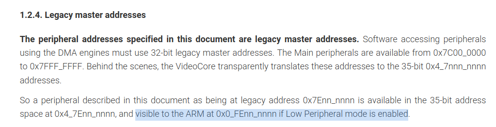

# Blink on bare metal Raspberry pi 4 with rust

After some time banging my head with old tutorials with raspberry pi 3 or other complexes with support for multiple boards I decided to create my own tutorial, the simplest possible program, the "hello word" of embedded: blink a led.

Already has a lot of tutorials for embedded systems on Rust, but Raspberry uses an Application-profile processor which allows us to have fun exploring OS stuff. Also is one common hardware that people already have.

## The smallest `#![no_std]` program

(This is an adaption of  [The Embedonomicon first chapter](https://docs.rust-embedded.org/embedonomicon/smallest-no-std.html) with the same for Raspberry pi code) 

### What does `#![no_std]` mean?

`#![no_std]` is a crate-level attribute that indicates that the crate will link to the `[core](https://doc.rust-lang.org/core/)` crate instead of the `[std](https://doc.rust-lang.org/std/)` crate, but what does this mean for applications?

The `std` crate is Rust's standard library. It contains functionality that assumes that the program will run on an operating system rather than *[directly on the metal](https://en.wikipedia.org/wiki/Bare_machine)*. `std` also assumes that the operating system is a general-purpose operating system, like the ones one would find in servers and desktops. For this reason, `std` provides a standard API over functionality one usually finds in such operating systems: Threads, files, sockets, a filesystem, processes, etc.

On the other hand, the `core` crate is a subset of the `std` crate that makes zero assumptions about the system the program will run on. As such, it provides APIs for language primitives like floats, strings, and slices, as well as APIs that expose processor features like atomic operations and SIMD instructions. However, it lacks APIs for anything that involves heap memory allocations and I/O.

For an application, `std` does more than just provide a way to access OS abstractions. `std` also takes care of, among other things, setting up stack overflow protection, processing command line arguments, and spawning the main thread before a program's `main` function is invoked. A `#![no_std]` application lacks all that standard runtime, so it must initialize its own runtime if any is required.

Because of these properties, a `#![no_std]` application can be the first and/or the only code that runs on a system. It can be many things that a standard Rust application can never be, for example:

- The kernel of an OS.
- Firmware.
- A bootloader.

## The code

With that out of the way, we can move on to the smallest `#![no_std]` program that compiles:

```bash
$ cargo new --bin kernel

$ cd kernel
```

```bash
$ # modify main.rs so it has these contents
$ cat src/main.rs
```

```rust
#![no_main]
#![no_std]

use core::panic::PanicInfo;

#[panic_handler]
fn panic(_panic: &PanicInfo<'_>) -> ! {
    loop {}
}
```

This program contains some things that you won't see in standard Rust programs:

The `#![no_std]` attribute which we have already extensively covered.

The `#![no_main]` attribute which means that the program won't use the standard `main` function as its entry point. At the time of writing, Rust's `main` interface makes some assumptions about the environment the program executes in: For example, it assumes the existence of command line arguments, so in general, it's not appropriate for `#![no_std]` programs.

The `#[panic_handler]` attribute. The function marked with this attribute defines the behavior of panics, both library-level panics (`core::panic!`) and language-level panics (out-of-bounds indexing).

This program doesn't produce anything useful. In fact, it will produce an empty binary.

For now, we also need to disable `test` and `brench` environments, they don’t work with your panic implementation.  So let’s do this on `Cargo.toml`

```toml
[package]
name = "kernel"
version = "0.1.0"
edition = "2021"

[dependencies]

[[bin]]
name = "kernel8"
path = "src/main.rs
test = false
bench = false
```

To compile you will need [cross-compile](https://docs.rust-embedded.org/book/start/qemu.html?highlight=cross#cross-compiling), your machine (probably x86-64 will generate) armv8 binary.

```bash
$ rustup target add aarch64-unknown-none-softfloat
```

The `aarch64-unknown-none-softfloat` is a [target triple](https://www.flother.is/til/llvm-target-triple/), that represents the `<architecture>-<vendor>-<sys>-<env>`. So we are generating binary for ARM64, without an operation system and using emulate float by software, without FPU.

Now let's build the binary

```bash
$ cargo build --target aarch64-unknown-none-softfloat --release
```

Let’s see the final binary:

```bash
$ # equivalent to `size target/aarch64-unknown-none-softfloat/release/kernel`
$ cargo size --target aarch64-unknown-none-softfloat --release --bin kernel
	Finished release [optimized] target(s) in 0.01s
text	   data	    bss	    dec	    hex	filename
      0	      0	      0	      0	      0	kernel1
```

Before linking, the crate contains the panicking symbol.

```bash
$ cargo rustc --target aarch64-unknown-none-softfloat -- --emit=obj

$ cargo nm -- target/thumbv7m-none-eabi/debug/deps/app-*.o | grep '[0-9]* [^N] '
00000000 T rust_begin_unwind
```

However, it's our starting point. In the next section, we'll build something useful. But before continuing, let's set a default build target to avoid having to pass the `--target` flag to every Cargo invocation.

```toml
$ mkdir .cargo

$ # modify .cargo/config so it has these contents
$ cat .cargo/config
```

```toml
[build]
target = "aarch64-unknown-none-softfloat"
```

## Memory layout

(This is an adaption of  [The Embedonomicon second chapter](https://docs.rust-embedded.org/embedonomicon/memory-layout.html), using [stirnemann](https://stirnemann.xyz/posts/rust_led/) and [rust-raspberrypi-OS](https://github.com/rust-embedded/rust-raspberrypi-OS-tutorials/blob/master/01_wait_forever/src/bsp/raspberrypi/kernel.ld) code) 

The Raspberry bootloader is located on EEPROM and ~~I don’t wanna~~ it’s hard to change, so we need to locate the entry point of the application in the same spot them the Linux (0x80000).

So we need to config the final memory layout of programs,  we can use [linker scripts](https://sourceware.org/binutils/docs/ld/Scripts.html) to have some control over it. The control granularity that linker scripts give us over the layout is at the level of *sections*. A section is a collection of *symbols* laid out in contiguous memory. Symbols, in turn, can be data (a static variable), or instructions (a Rust function).

Every symbol has a name assigned by the compiler. As of Rust 1.28 , the names that the Rust compiler assigns to symbols are of the form: `_ZN5krate6module8function17he1dfc17c86fe16daE`, which demangles to `krate::module::function::he1dfc17c86fe16da` where `krate::module::function` is the path of the function or variable and `he1dfc17c86fe16da` is some sort of hash. The Rust compiler will place each symbol into its own unique section; for example the symbol mentioned before will be placed in a section named `.text._ZN5krate6module8function17he1dfc17c86fe16daE`.

These compiler-generated symbols and section names are not guaranteed to remain constant across different releases of the Rust compiler. However, the language lets us control symbol names and section placement via these attributes:

- `#[export_name = "foo"]` sets the symbol name to `foo`.
- `#[no_mangle]` means: use the function or variable name (not its full path) as its symbol name. `#[no_mangle] fn bar()` will produce a symbol named `bar`.
- `#[link_section = ".bar"]` places the symbol in a section named `.bar`.

With these attributes, we can expose a stable ABI of the program and use it in the linker script.

### Rust side

So let's write our kernel entry point, I’m calling this `_start` as the [C runtime](https://stackoverflow.com/a/29694977) does. This is the function that the device will execute after a system reset, or after it powers up for the first time. The reset handler is always the first stack frame in the hardware call stack; returning from it is undefined
behavior as there's no other stack frame to return to. We can enforce that the reset handler never
returns by making it a divergent function, which is a function with signature `fn(/* .. */) -> !`. and using an infinite loop.

```rust
#[no_mangle]
#[link_section = ".text._start"]
pub extern "C" fn _start() -> ! {
	loop {}
}
```

The hardware expects a certain format here, to which we adhere by using `extern "C"` to tell the
compiler to lower the function using the C ABI, instead of the Rust ABI, which is unstable.

To refer to the reset handler from the linker script, we need them to have a stable symbol name so we use `#[no_mangle]`. We need fine control over the location of `_start`, so we
place it in a known section, `.text._start`. The exact location of the rest of the code isn’t important so we just stick to the default compiler generated section.

The linker will ignore symbols with internal linkage (also known as internal symbols) while traversing the list of input object files, so we need our symbol to have external linkage. The only way to make a symbol external in Rust is to make its corresponding item public (`pub`) and *reachable* (no private module between the item and the root of the crate).

### The linker script side

A minimal linker script that places the vector table in the correct location is shown below. Let's walk through it.

```bash
$ cat linker.ld
```

```bash
SECTIONS
{
    . = 0x80000;
    .text :
    {
        *(.text._start)
        *(.text*)
    }
    /DISCARD/ :
	  {
	    *(.ARM.exidx .ARM.exidx.*);
	  }
}
```

### Putting it all together

Now we can link the application.

We have to tweak the linker process to make it use our linker script. This is done by passing the `-C link-arg` flag to `rustc`. This can be done with `cargo-rustc` or `cargo-build`.

**IMPORTANT**: Make sure you have the `.cargo/config` file that was added at the
end of the last section before running this command.

Using the `cargo-rustc` sub-command:

```bash
$ cargo rustc -- -C link-arg=-Tlinker.ld
```

Or you can set the rust flags in `.cargo/config.toml` and continue using the `cargo-build` sub-command. 

```bash
# modify .cargo/config so it has these contents
$ cat .cargo/config.toml
```

```toml
[target.'cfg(all(target_arch = "aarch64", target_os = "none"))']
rustflags = ["-C", "link-arg=-Tlinker.ld"]

[build]
target = "thumbv7m-none-eabi"
```

The `[target.'cfg(all(target_arch = "aarch64", target_os = "none"))']` part says that these flags will only be used when cross compiling to any target with with `aarch64` architecture and no OS.

### Inspecting it

Now let’s use [cargo-binutils](https://github.com/rust-embedded/cargo-binutils) to inspect the output binary and confirm the memory layout looks the way we want. For reference, here's the complete Rust program:

```rust
#![no_main]
#![no_std]

use core::panic::PanicInfo;

#[panic_handler]
fn panic(_panic: &PanicInfo<'_>) -> ! {
    loop {}
}

#[no_mangle]
#[link_section = ".text._start"]
pub extern "C" fn _start() -> ! {
	loop {}
}
```

First, install `cargo-binutils` with cargo.

```bash
$ cargo install cargo-binutils
$ rustup component add llvm-tools-previewrustup component add llvm-tools-preview
```

Then, use the object dump to read the binary. The `cargo-binutils` is smart and looks to rebuild your code if necessary and also sees the target on `.cargo/config.toml`.

```toml
$ cargo objdump -- -d --no-show-raw-insn
```

```bash
$ cargo objdump --bin kernel8 -- -d --no-show-raw-insn
   Compiling kernel v0.1.0 (/home/guiss/p/labproc/tutorial/kernel)
    Finished dev [unoptimized + debuginfo] target(s) in 0.04s

kernel8:        file format elf64-littleaarch64

Disassembly of section .text:

0000000000080000 <_start>:
   80000:       b       0x80004 <_start+0x4>
   80004:       b       0x80004 <_start+0x4>
```

We can see that your `_start` section is located on `0x0000000000080000` and implements the loop on position `0x80004` (if you run with `--release` it’s only one instruction)

## LED blinking

### Addresses

The arm [peripherals are mapped in memory](https://docs.rust-embedded.org/book/start/registers.html), all I/O configs are made by writing and reading a specific address on memory, we can find this information on [BCM2711 peripherals datasheet](https://datasheets.raspberrypi.com/bcm2711/bcm2711-peripherals.pdf).


The datasheets use the Legacy Master addresses, but the Raspberry [use the “Low Peripheral” mode by default](https://github.com/isometimes/rpi4-osdev/issues/13#issuecomment-841869471).  So we need to translate the addresses `0x73nn_nnnn` to `0xFEnn_nnnn`.



### GPIO

We want to blink the green led built-in on board, that is pin 42 (this could be found [on Linux device tree](https://github.com/raspberrypi/linux/blob/rpi-5.10.y/arch/arm/boot/dts/bcm2711-rpi-4-b.dts#L30-L33)), so we need to control the GPIO. Let's check session 5.2 Register View on the datasheet. 


Calculating the offset and replacing the low peripheral address:

- `0xFE20_0000`: GPIO Function Select 4
- `0xFE20_0020`: GPIO Pin Output Set 0
- `0xFE20_002c`: GPIO Pin Output Clear

Before all, we need to config what type of our pin, if is output, or input, etc. For this, we need to write `0b001` on bits `8..6` on `GPFSELF4`, as we can see on the datasheet.


And writing `1` in `GPSET1[15]` we can enable the GPIO42 output, and by writing `1` in `GPCLR1[15]` we disable the GPIO42 output.


### Show me the code!

With that spoken, finally, we could write our blink code.

```rust
#![no_main]
use core::panic::PanicInfo;
use core::arch;

#[panic_handler]
fn panic(_panic: &PanicInfo<'_>) -> ! {
    loop {}
}

// https://datasheets.raspberrypi.com/bcm2711/bcm2711-peripherals.pdf
const START:            usize = 0xFE00_0000; // Based on section 1.2 of manual
const GPIO_OFFSET:      usize = 0x0020_0000; // Based on section 5.2 of manual, also check that
                                             // 0x7enn_nnnn is mapped to 0xFEnn_nnnn
const GPIO_START:       usize = START + GPIO_OFFSET;

#[no_mangle]
#[link_section = ".text._start"]
pub extern "C" fn _start() -> ! {
    unsafe {
        // Set GPIO 42 with GPFSEL4[8:6] = 0b001
        core::ptr::write_volatile((GPIO_START + 0x10) as *mut u32, 0b001 << 6);
        loop {
            // Set GPIO 42 to HIGH with GPSET1
            core::ptr::write_volatile((GPIO_START + 0x20) as *mut u32, 1 << (42-32));

            // Wait
            for _ in 0..500000 {
                arch::asm!("nop");
            }

            // Set GPIO 42 to LOW with GPCLR[42-32]
            core::ptr::write_volatile((GPIO_START + 0x02c) as *mut u32, 1 << (42-32));

            // Wait
            for _ in 0..500000 {
                arch::asm!("nop");
            }
        }
    }
}
```

Here we need the write_volatile to assert that compiler optimization will not remove your instruction (you could read more about that in the [embedded rust book](https://docs.rust-embedded.org/book/peripherals/a-first-attempt.html?highlight=volatile#volatile-accesses)).

## Programming the raspberry

Before seeing some light we first need to write our code on the SD to put in the Raspberry.

### Format the SD card

**IMPORTANT:** If you don’t know what you are doing, I deeply recommend installing *Raspbian* with [the Raspberry tool](https://www.raspberrypi.com/software/) and only replacing the kernel. Formatting the wrong partition could delete all your data.

For those who keep reading let's start. First, you need to connect your SD card to your pc, then you need to find the device. I like to use `fdisk -l` and search for new devices, in **my** case is `/dev/sda` which already has RaspebianOS partitions. So we need to format and create the new FAT32 partitions.

```bash
$ sudo fdisk /dev/<device>
Command (m for help): d # delete existent partitions
Command (m for help): d # keep deleting ...

Command (m for help): n
Partition type
   p   primary (0 primary, 0 extended, 4 free)
   e   extended (container for logical partitions)
Select (default p): p
Partition number (1-4, default 1): 1
First sector (2048-124735487, default 2048): <enter>
Last sector, +/-sectors or +/-size{K,M,G,T,P} (2048-124735487, default 124735487): <enter>

# change partition to FAT32
Command (m for help): t

Hex code or alias (type L to list all): 0x0c
Changed type of partition 'Linux' to 'W95 FAT32 (LBA)'.

Command (m for help): w

$ sudo mkfs.vfat -F32 /dev/<device>
```

### Setup default files

```bash
$ sudo mkdir -p /mnt/sdcard
$ sudo mount  /dev/<device>1 /mnt/sdcard

$ sudo curl -L -o /mnt/sdcard/fixup4.dat https://github.com/raspberrypi/firmware/raw/master/boot/fixup4.dat
$ sudo curl -L -o /mnt/sdcard/start4.elf https://github.com/raspberrypi/firmware/raw/master/boot/start4.elf
$ sudo curl -L -o /mnt/sdcard/bcm2711-rpi-4-b.dtb https://github.com/raspberrypi/firmware/raw/master/boot/bcm2711-rpi-4-b.dtb
$ sudo touch /mnt/sdcard/config.txt
```

We are keeping `config.txt` empty by now, as we are naming our kernel as `kernel8.img` the bootloader already knows that is arm64bits, but if you are paranoid you can put `arm_64bit=1`

### Copy our code to raspberry

The current binary is in ELF format and we need to flatten it to a raw binary. We can do that with `objcopy`.

```bash
$ cargo objcopy --release -- -O binary kernel8.img

$ sudo cp ./kernel8.img /mnt/sdcard/kernel8.img

$ sudo umount /mnt/sdcard
```

And the SD card is ready to be plugged in the Raspi. And you could see the light!


## We ❤️ cargo&crates

Let's install some dependencies to make our life easier and make the C/C++ people jealous.

We could use the [aarch64 processor crate](https://github.com/rust-embedded/aarch64-cpu) to run specific *asm* instructions and read/write CPU registers (like arm co-processors).

```bash
$ cargo add aarch64-cpu 
$ cargo add tock-register # we will need this later to read register value
```

```diff
diff --git a/src/main.rs b/src/main.rs
index db65813..9737a2a 100644
--- a/src/main.rs
+++ b/src/main.rs
@@ -2,7 +2,7 @@
 #![no_std]

 use core::panic::PanicInfo;
-use core::arch;
+use aarch64_cpu::asm::nop;

 #[panic_handler]
 fn panic(_panic: &PanicInfo<'_>) -> ! {
@@ -27,7 +27,7 @@ pub extern "C" fn _start() -> ! {

             // Wait
             for _ in 0..500000 {
-                arch::asm!("nop");
+                nop();
             }

             // Set GPIO 42 to LOW with GPCLR[42-32]
@@ -35,7 +35,7 @@ pub extern "C" fn _start() -> ! {

             // Wait
             for _ in 0..500000 {
-                arch::asm!("nop");
+                nop();
             }
         }
     }
```

Also, we could use a crate to implement the panic

```bash
$ cargo add panic-halt
```

```diff
diff --git a/src/main.rs b/src/main.rs
index 9737a2a..82d0f84 100644
--- a/src/main.rs
+++ b/src/main.rs
@@ -1,13 +1,9 @@
 #![no_main]
 #![no_std]

-use core::panic::PanicInfo;
 use aarch64_cpu::asm::nop;

-#[panic_handler]
-fn panic(_panic: &PanicInfo<'_>) -> ! {
-    loop {}
-}
+use panic_halt as _;
```

## A little multi-core detail

When we start the CPU, all four cores will execute the same code, so now our code is written 4 times on the GPIO in parallel.

To fix that we need to check what core we are executing [(reding MPIDR_EL1 register](https://github.com/rust-embedded/rust-raspberrypi-OS-tutorials/blob/49a25275e66ab0dcacfcbbbb666311df7a9650c9/05_drivers_gpio_uart/src/_arch/aarch64/cpu/boot.s#L29-L35)) and half 3 cores. In this case, we choose the CPU0 to run our core, the other cores will sleep (with `wfe` instruction).

```diff
diff --git a/src/main.rs b/src/main.rs
index 82d0f84..ea331ef 100644
--- a/src/main.rs
+++ b/src/main.rs
@@ -4,6 +4,7 @@
 use aarch64_cpu::asm::nop;

 use panic_halt as _;
+use tock_registers::interfaces::Readable;

 // https://datasheets.raspberrypi.com/bcm2711/bcm2711-peripherals.pdf
 const START:            usize = 0xFE00_0000; // Based on section 1.2 of manual
@@ -14,6 +15,10 @@ const GPIO_START:       usize = START + GPIO_OFFSET;
 #[no_mangle]
 #[link_section = ".text._start"]
 pub extern "C" fn _start() -> ! {
+    if get_cpu_id() != 0 {
+        aarch64_cpu::asm::wfe();
+    }
+
     unsafe {
         // Set GPIO 42 with GPFSEL4[8:6] = 0b001
         core::ptr::write_volatile((GPIO_START + 0x10) as *mut u32, 0b001 << 6);
@@ -36,3 +41,7 @@ pub extern "C" fn _start() -> ! {
         }
     }
 }
+
+fn get_cpu_id() -> u64 {
+    aarch64_cpu::registers::MPIDR_EL1.get() & 0b11
+}
```

# Conclusion
Thank you for the amazing class that gave me the push to get here.

The code is avaliable on [this repo](https://github.com/guissalustiano/raspiberry-4-bare-metal-blink-rust).

If you have some trouble or recommendation please write-me on [twitter](https://twitter.com/guissalustiano) or [email](malito:guissalustiano@gmail.com).


### References:

- [Bare metal Raspberry PI blink In RUST - Stirnemann](https://stirnemann.xyz/posts/rust_led/)
- [rust-embedded/rust-raspberrypi-OS-tutorials](https://github.com/rust-embedded/rust-raspberrypi-OS-tutorials/tree/49a25275e66ab0dcacfcbbbb666311df7a9650c9)
- [BCM2711 ARM Peripherals Datasheet](https://datasheets.raspberrypi.com/bcm2711/bcm2711-peripherals.pdf)
- [Bare metal LED access on RPi 4 - Stackexchange](https://raspberrypi.stackexchange.com/questions/135867/bare-metal-led-access-on-rpi-4)
- [The Embedonomicon](https://docs.rust-embedded.org/embedonomicon/)
- [The Embedded Rust Book](https://docs.rust-embedded.org/book/intro/index.html)
- [rust-embedded/cortex-m-quickstart](https://github.com/rust-embedded/cortex-m-quickstart)
- [Raspberry throbleshooting booting partition](https://www.raspberrypi.com/documentation/computers/compute-module.html#troubleshooting)
- [bru4bas/labproc/raspberry/led](https://github.com/bru4bas/labproc/blob/master/raspberry/led/main.c) (btw my professor)
